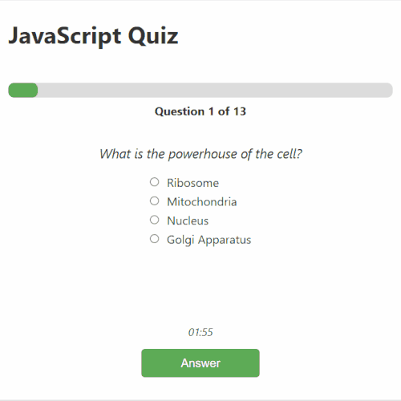

# 1 - Project: JavaScript Quiz

## Students
### Richard Nixon and Kainat Naseer

## Project Requirements

Create a Quiz app using JavaScript, OOP, and DOM. Key tasks include:

- Organize data with classes (e.g., `Question`, `Quiz`).
- Use class methods to manage object properties with `this`.
- Implement interactive features with DOM and Event Listeners.
- Add a countdown timer using `setInterval/clearInterval`.
- Maintain clean, well-organized code with descriptive variable names and proper file structure.

## Topics by Day

### Day 1:
- Fork and clone the repo, review starter code.
- Organize data with `Question` and `Quiz` classes.
- Commit changes frequently.

### Day 2:
- Implement methods like `filterQuestionsByDifficulty()` and `averageDifficulty()`.

### Day 3:
- Use DOM and Event Listeners to make the quiz interactive.
- Implement functions like `showQuestion()`, `nextButtonHandler()`, `showResults()`, and a “Restart Quiz” button.

### Day 4:
- Implement a quiz timer and restart logic.
